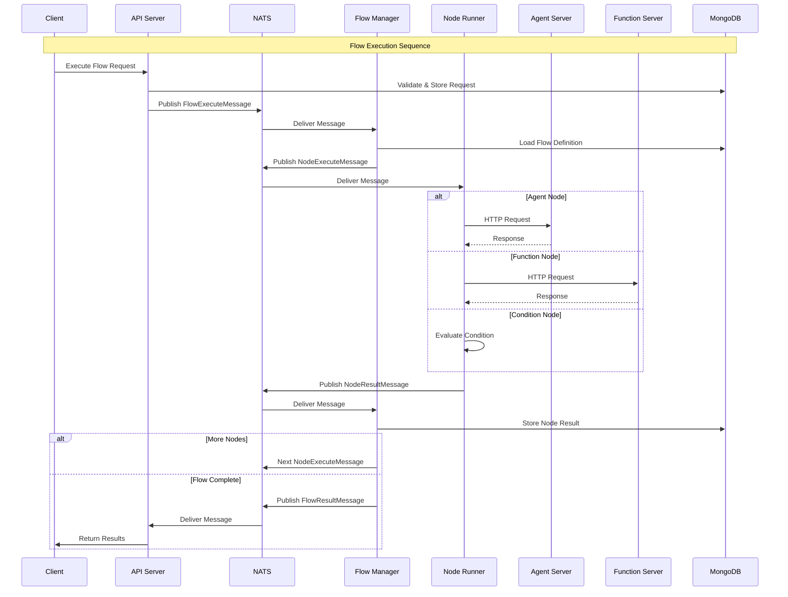
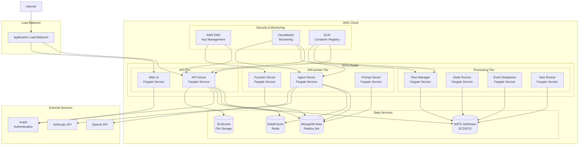

# DECA AI Studio - System Architecture Diagram

```mermaid
graph TB
    %% External Clients and Triggers
    Client[Web UI Client] --> Auth0{Auth0}
    WebhookSource[External Webhook Sources] --> WHReceiver[Webhook Receiver]
    Scheduler[Cron Scheduler] --> SchDispatcher[Schedule Dispatcher]

    %% Authentication
    Auth0 --> APIServer[API Server<br/>:8080]

    %% Core API and Entry Point
    APIServer --> MongoDB[(MongoDB<br/>Replica Set)]
    APIServer --> Redis[(Redis<br/>Cache)]
    APIServer --> NATS[NATS JetStream<br/>Message Queue]

    %% Service Communication via NATS
    NATS --> FlowManager[Flow Manager<br/>:8081]
    NATS --> NodeRunner[Node Runner<br/>:8082]
    NATS --> EventDispatcher[Event Dispatcher<br/>:8083]
    NATS --> TaskRunner[Task Runner<br/>:8084]

    %% Specialized Services
    APIServer -.->|HTTP| AgentServer[Agent Server<br/>:8000<br/>Python/FastAPI]
    APIServer -.->|HTTP| FunctionServer[Function Server<br/>:8085]
    APIServer -.->|HTTP| PromptServer[Prompt Server<br/>:8001<br/>Python/FastAPI]

    %% MCP Server
    MCPServer[MCP Server<br/>:8002<br/>Python] --> CRM[CRM Integration]

    %% Flow Execution Chain
    FlowManager --> NodeRunner
    NodeRunner --> AgentServer
    NodeRunner --> FunctionServer
    NodeRunner --> PromptServer

    %% Event Flow
    WHReceiver --> EventDispatcher
    SchDispatcher --> EventDispatcher
    EventDispatcher --> FlowManager

    %% Background Processing
    FlowManager --> NATS
    NATS --> TaskRunner

    %% Shared Data Stores
    FlowManager --> MongoDB
    NodeRunner --> MongoDB
    AgentServer --> MongoDB
    FunctionServer --> MongoDB
    TaskRunner --> MongoDB

    FlowManager --> Redis
    AgentServer --> Redis

    %% External Integrations
    AgentServer --> OpenAI[OpenAI API]
    AgentServer --> AnthropicAPI[Anthropic API]
    NodeRunner --> GoogleAPI[Google APIs]
    NodeRunner --> ZendeskAPI[Zendesk API]
    NodeRunner --> S3[AWS S3]

    %% Web UI App
    UIApp[Agent App UI<br/>React/TypeScript<br/>:3000] --> APIServer
    UIApp --> Auth0

    %% Shared Go Components
    subgraph "Go Internals Package"
        Config[Config Management]
        Database[Database Layer]
        Logger[Centralized Logging]
        Models[Shared Models]
        Middleware[HTTP Middleware]
        Utils[Utility Functions]
    end

    %% Dependencies
    FlowManager -.-> Config
    NodeRunner -.-> Database
    APIServer -.-> Logger
    FunctionServer -.-> Models
    TaskRunner -.-> Middleware
    EventDispatcher -.-> Utils

    %% Node Types Available
    subgraph "Node Types (35+)"
        CoreNodes[Agent, Function, Condition<br/>Loop, Transform, Branch]
        TriggerNodes[Webhook, Schedule, Event<br/>Triggers]
        DecaNodes[DECA Chatbot, Pages, Forms<br/>Knowledge Base, CRM, Tables]
        IntegrationNodes[OpenAI, Google, Zendesk<br/>Code Execution, Wait]
    end

    NodeRunner -.-> CoreNodes
    NodeRunner -.-> TriggerNodes
    NodeRunner -.-> DecaNodes
    NodeRunner -.-> IntegrationNodes

    %% Styling
    classDef goService fill:#e1f5fe,stroke:#01579b,stroke-width:2px
    classDef pythonService fill:#fff3e0,stroke:#e65100,stroke-width:2px
    classDef webService fill:#f3e5f5,stroke:#4a148c,stroke-width:2px
    classDef database fill:#e8f5e8,stroke:#1b5e20,stroke-width:2px
    classDef external fill:#fce4ec,stroke:#880e4f,stroke-width:2px
    classDef messaging fill:#fff8e1,stroke:#ff8f00,stroke-width:2px

    class APIServer,FlowManager,NodeRunner,EventDispatcher,FunctionServer,TaskRunner,SchDispatcher,WHReceiver goService
    class AgentServer,PromptServer,MCPServer pythonService
    class UIApp,Client webService
    class MongoDB,Redis database
    class Auth0,OpenAI,AnthropicAPI,GoogleAPI,ZendeskAPI,S3,CRM external
    class NATS messaging
```



## Data Flow Diagram



## Component Interaction Matrix

| Component | API Server | Flow Manager | Node Runner | Agent Server | Function Server | NATS | MongoDB | Redis |
|-----------|------------|--------------|-------------|--------------|----------------|------|---------|-------|
| **API Server** | - | ✓ (NATS) | ✓ (NATS) | ✓ (HTTP) | ✓ (HTTP) | ✓ | ✓ | ✓ |
| **Flow Manager** | ✓ (NATS) | - | ✓ (NATS) | - | - | ✓ | ✓ | ✓ |
| **Node Runner** | ✓ (NATS) | ✓ (NATS) | - | ✓ (HTTP) | ✓ (HTTP) | ✓ | ✓ | - |
| **Agent Server** | ✓ (HTTP) | - | ✓ (HTTP) | - | ✓ (HTTP) | - | ✓ | ✓ |
| **Function Server** | ✓ (HTTP) | - | ✓ (HTTP) | ✓ (HTTP) | - | - | ✓ | - |
| **Event Dispatcher** | ✓ (NATS) | ✓ (NATS) | - | - | - | ✓ | ✓ | - |
| **Task Runner** | - | ✓ (NATS) | - | - | - | ✓ | ✓ | - |
| **Web UI** | ✓ (HTTP) | - | - | - | - | - | - | - |

## Infrastructure Deployment View



## Message Flow Patterns

### Flow Execution Pattern
```
Trigger → [FlowExecuteMessage] → Flow Manager
Flow Manager → [NodeExecuteMessage] → Node Runner
Node Runner → [NodeResultMessage] → Flow Manager
Flow Manager → [FlowCompleteMessage] → API Server
```

### Event Processing Pattern
```
Webhook → [WebhookEventMessage] → Event Dispatcher
Schedule → [ScheduleEventMessage] → Event Dispatcher
Event Dispatcher → [EventMessage] → Flow Manager
```

### Task Processing Pattern
```
Flow Manager → [TaskExecuteMessage] → Task Runner
Task Runner → [TaskResultMessage] → Flow Manager
```